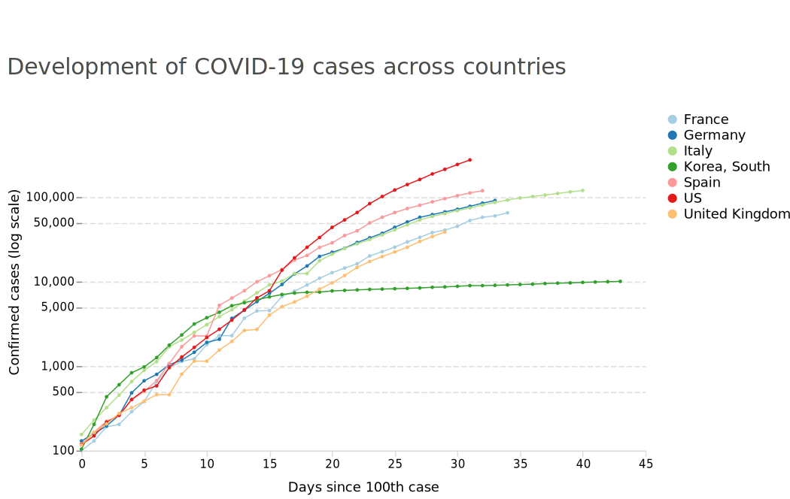

# Covid-19 Visualization
This repository visualizes development of Covid-19 cases. 

Data comes from John Hopkins University: https://github.com/CSSEGISandData/COVID-19

Charts are generated using altair: https://altair-viz.github.io

## Case development
In recent days, researchers and (partly) governments have pointed to the importance of action in the light of exponential growth. It is hard to compare exponential growth across countries on a linear scale. Therefore, I created a chart that plots case count against a log scale. Days with less than 100 reported cases in one country have been filtered out.

One can clearly see that countries are in different stages of the epidemic. Italy is far ahead of the pack in cases. 

But how does the development of the pandemic in countries really compare? Are case figures growing with the same speed? Following an example visualization from the Financial Times, I normed each country on the time axis to the first day with the 100th confirmed COVID-19 case:

South Korea has successfully managed to curb growth rates at a a very early stage of the epidemic. So far (as of March 20th), western countries struggle to achieve the same, as growth continues without showing a sign of slowing down.

## Putting deaths and infections into perspective
Several news reports suspect that case counts in some countries may understate the actual development. As such, the recent figures merely reflect a state's ability to detect and report COVID-19 cases instead of the true number of infections. Putting infections and deaths into relation reveals vast differences between countries. Especially in the early stages of the pandemic, some countries show a very high rate of deaths in infections. This may lead to the dangerous conclusion that the disease is more deadly in the US and Italy than it is in other countries. One plausible factor that drives these differences could be that countries with a very high rate of deaths in infections struggle to discover COVID-19 cases.

The US may have been undertesting as it struggled to provide tests that work. Italy's testing capacity may currently be overwhelmed with new cases, where only severe ones are tested and mild ones go undetected and will be cured at home.