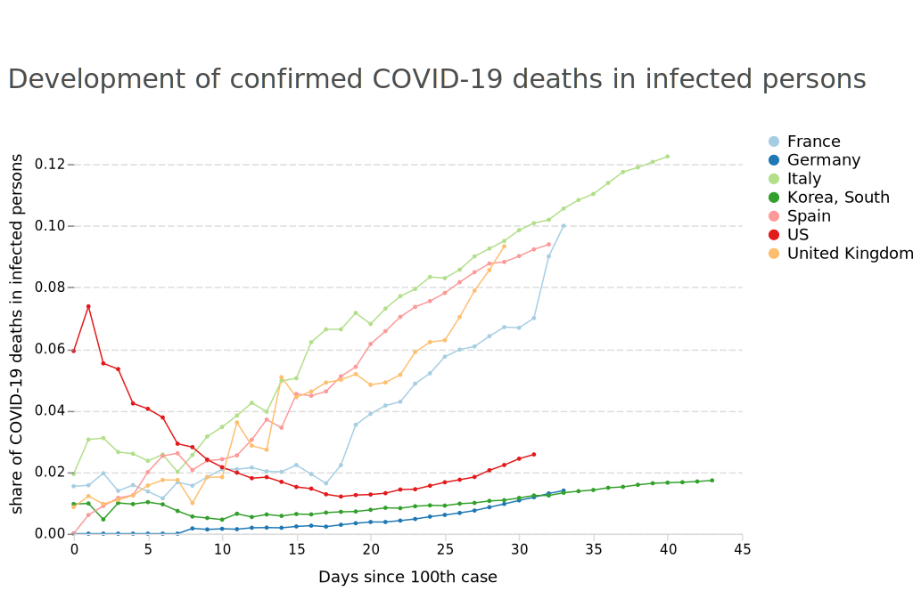

# Covid-19 Visualization
This repository visualizes development of Covid-19 cases. 

Data comes from John Hopkins University: https://github.com/CSSEGISandData/COVID-19

Charts are generated using altair: https://altair-viz.github.io

## Case development
In recent days, researchers and (partly) governments have pointed to the importance of action in the light of exponential growth. Following an example visualization from the Financial Times, I generated a chart for a couple of developed countries that show their case counts since the day of the 100th COVID-19 case featuring a log scale:

file://./charts/covid_cases.html

## Putting deaths and infections into perspective
Several news reports suspect that case counts in some countries may understate the actual development. As such, the recent figures merely reflect a state's ability to detect and report COVID-19 cases instead of the true number of infections. Putting infections and deaths into relation reveals vast differences between countries. Especially in the early stages of the pandemic, some countries show a very high rate of deaths in infections. This may lead to the dangerous conclusion that the disease is more deadly in the US and Italy than it is in other countries. One plausible factor that drives these differences could be that countries with a very high rate of deaths in infections struggle to discover COVID-19 cases.

The US may have been undertesting as it struggled to provide tests that work. Italy's testing capacity may currently be overwhelmed with new cases, where only severe ones are tested and mild ones go undetected and will be cured at home.